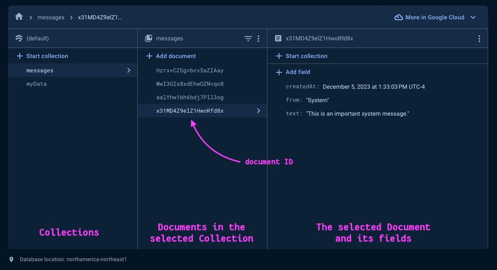

# Firebasics (The basics of Firebase)

Firebase is an app development platform, built and maintained by Google, that speeds up app development because it provides a _Backend-as-a-Service (BaaS)_. Firebase eliminates the need to write and maintain server-side code - things like user authentication, trusted API calls, security logic, database connections, traffic scaling, etc. Firebase makes this possible by providing you with a variety of frontend _Software Development Kits (SDKs)_ that connect your web/mobile apps to various Google Cloud Resources.

How can we use Firebase to simplify our app development?

- Setup basic user auth with Google Sign-In. (authentication)
- Create Firestore database records and listen to changes in realtime. (firestore)
- Use the Firebase CLI Tools to manage and deploy an app. (hosting)


## How to connect your app to Firebase

1. Create a new project on https://console.firebase.google.com
2. Click on the _Web </>_ button to add a project for web.
3. Fill in the _"app nickname" field an submit the form.
4. Grab the `firebaseConfig` object generated by Firebase and store it in a `secrets.js` file in the `/src` directory _(eg. `/src/secrets.js`)_. *
5. In the Firebase Console side-nav, drill down to **Build > Authentication > Get started**.
  - Here you should enable your preferred sign-in method(s) _(eg. Google, Facebook, Twitter, Email/Password)_
  - _**TIP:**_ Keep the default config options for each sign-in method.
6. In the Firebase Console side-nav,  drill down to **Build > Firestore Database > Create database**.
  - Set name (default) and location (Montreal)
  - Secure rules: "Start in test mode" <-- _we will lock this down later_

_* At first glance, the Firebase configuration settings seem as though they should be private and not exposed in the browser. That is not the case, though; they are safe to include in your client-side JavaScript. Your application is secured using Firebase authentication and Firestore security rules. You can read more about it [here](https://firebase.google.com/docs/firestore/security/get-started). Generally, it is considered a security risk to commit your API keys and other private data to your GitHub repo. This is why we are saving our config in `secrets.js` -- to get in the habit of keeping our secrets safe!_

#### Resources:
- Firebasics Repo on [Github](https://github.com/yoSteve/firebasics-react)   <-- _you are here_
- Firebase docs for [basic security rules](https://firebase.google.com/docs/rules/basics?authuser=0&hl=en)

## Firestore Database

### What is a Firestore Collection?
Cloud Firestore is a document-oriented database (No-SQL). Unlike a tabular database (SQL), there are no tables or rows. Instead, you store data in **documents**, which are organized into **collections**.

Each document contains a set of key-value pairs. Cloud Firestore is optimized for storing large collections of small documents. Documents are just like JavaScript Objects in that they can contain nested objects, which can include primitive fields like strings or complex objects like lists.

All documents must be stored in **collections**. Collections can be thought of as groupings of similar documents. For example a "messages" collection can hold all your messages for a chat app, and "toppings" collection can hold all your pizza toppings for your pizza-ordering app.

Collections and documents are created implicitly in Cloud Firestore. Simply assign data to a document within a collection. If either the collection or document does not exist, Cloud Firestore creates it.

### Create a Firestore collection
1. Go to **Firebase Console side-nav > Build > Firestore Database**
2. Click "+ Start colletion"
3. Name your collection (Collection ID). ***TIP:** Don't use spaces or special characters.*
4. Add at least one document to your collection. Use "Add field" to add properties to your document. Click the "Auto-ID" button to generate a unique ID.

You can add additional documents, or edit existing ones from the Firestore Database Dashboard.


*The Firestore database dashboard*

#### Resources
- [Firestore Quick Start Guide](https://firebase.google.com/docs/firestore/quickstart#web-modular-api) ***NOTE:** Code examples should follow the "Web Modular API" format.*
- [Firestore Data Model](https://firebase.google.com/docs/firestore/data-model)
- [Firestore Data Types](https://firebase.google.com/docs/firestore/manage-data/data-types)

## React Firebase Hooks
React Firebase Hooks provides convenience listeners for collections and documents stored with Firestore. The hooks wrap around the built-in `firestore.onSnapshot(...)` method.

There are 2 variants of each hook:
1. `useX` which subscribes to the underlying collection or document and _listens for changes_.
2. `useXOnce` which reads the current value of the collection or document.

The value returned by the hook will contain a `docs` object. In the case of a collection, this is an array of document objects. Each of which has a `.data()` method that must be called to extract the data.

```
import { initializeApp } from 'firebase/app';
import { getAuth } from 'firebase/auth';
import { collection, getFirestore } from 'firebase/firestore';
import { useCollection } from 'react-firebase-hooks/firestore';

const firebaseApp = initializeApp(FIREBASE_CONFIG);
const db = getFirestore(firebaseApp);
const messagesCollection = collection(db, 'messages');

const MessageList = () => {
  const [ messages, loading, error ] = useCollection(messagesCollection);

  return (
    <div>
      { error && <strong>Something went wrong</strong> }

      { loading && <strong>Loading...</strong> }

      { messages && <ul>
        { messages.docs.map(doc => (
          <li key={doc.id}>{JSON.stringify(doc.data())}</li>
        )) }
      </ul> }
    </div>
  )
}
```

To add a document to a collection you must call the `addDoc` message. This will take a reference to the desired collection, and an object representing the data you wish to store.

```
import { addDoc, serverTimestamp } from 'firebase/firestore';

async function handleSubmit(text) {
  await addDoc(messagesCollection, {
    text,
    from: user.displayName,
    createdAt: serverTimestamp() // <-- Firestore will put a timestamp here when it creates the document

  })
}
```

To update a document you must call `updateDoc`. This method requires you to pass in the document ID. This method allows you to update specified fields without overwriting the entire document.

```
import { doc, updateDoc } from "firebase/firestore";

async function handleUpdate(newText, documentId) {
  // Get a reference to the document you wish to update in the "messages" collection:
  const documentRef = doc(db, "messages", documentId);

  // Update the "from" field only:
  await updateDoc(documentRef, {
    from: 'Your mom'
  });
}
```

Deleting a document requires the document Id:

```
import { doc, deleteDoc } from "firebase/firestore";

async function handleDelete(documentId) {
  // Get a reference to the document you wish to delete in the "messages" collection:
  const documentRef = doc(db, "messages", documentId);

  await deleteDoc(documentRef);
}
```

#### Resources
- [Firestore Add Data](https://firebase.google.com/docs/firestore/manage-data/add-data)
- [Firestore Update a Document](https://firebase.google.com/docs/firestore/manage-data/add-data#update-data)
- [Firestore Delete a Document](https://firebase.google.com/docs/firestore/manage-data/delete-data)
- [React Firebase Hooks Documentation](https://github.com/CSFrequency/react-firebase-hooks/tree/master)
- [React Firebase Hooks - Firestore Hooks](https://github.com/CSFrequency/react-firebase-hooks/blob/master/firestore/README.md)
- [React Firebase Hooks - Auth Hooks](https://github.com/CSFrequency/react-firebase-hooks/blob/master/auth/README.md)

### Firestore security rules
At some point, your database will need full server-side [security rules](https://firebase.google.com/docs/rules/basics) in place. Without rules, your app is vulnerable to exploitation because any hacker could grab your project config start writing to Firestore.

The rules below ensure that  
- (A) the entire database is locked down and 
- (B) authenticated users can ONLY modify their own data. 

You can configure these rules from the **Firestore Database > Rules tab**.

```
// firestore.rules

rules_version = '2';
service cloud.firestore {
  match /databases/{database}/documents {

    // Lock down the database
    match /{document=**} {
      allow read, write: if false; 
    
    // Allow authorized requests to the myItems collection
    match /myItems/{docId} {
      allow write: if request.auth.uid == request.resource.data.uid;
      allow read: if request.auth.uid == resource.data.uid;
    }
    
  }
}
```
##  
#### Here follows the auto-generated README from Create React App
##
# Getting Started with Create React App

This project was bootstrapped with [Create React App](https://github.com/facebook/create-react-app).

## Available Scripts

In the project directory, you can run:

### `npm start`

Runs the app in the development mode.\
Open [http://localhost:3000](http://localhost:3000) to view it in your browser.

The page will reload when you make changes.\
You may also see any lint errors in the console.

### `npm test`

Launches the test runner in the interactive watch mode.\
See the section about [running tests](https://facebook.github.io/create-react-app/docs/running-tests) for more information.

### `npm run build`

Builds the app for production to the `build` folder.\
It correctly bundles React in production mode and optimizes the build for the best performance.

The build is minified and the filenames include the hashes.\
Your app is ready to be deployed!

See the section about [deployment](https://facebook.github.io/create-react-app/docs/deployment) for more information.

### `npm run eject`

**Note: this is a one-way operation. Once you `eject`, you can't go back!**

If you aren't satisfied with the build tool and configuration choices, you can `eject` at any time. This command will remove the single build dependency from your project.

Instead, it will copy all the configuration files and the transitive dependencies (webpack, Babel, ESLint, etc) right into your project so you have full control over them. All of the commands except `eject` will still work, but they will point to the copied scripts so you can tweak them. At this point you're on your own.

You don't have to ever use `eject`. The curated feature set is suitable for small and middle deployments, and you shouldn't feel obligated to use this feature. However we understand that this tool wouldn't be useful if you couldn't customize it when you are ready for it.

## Learn More

You can learn more in the [Create React App documentation](https://facebook.github.io/create-react-app/docs/getting-started).

To learn React, check out the [React documentation](https://reactjs.org/).

### Code Splitting

This section has moved here: [https://facebook.github.io/create-react-app/docs/code-splitting](https://facebook.github.io/create-react-app/docs/code-splitting)

### Analyzing the Bundle Size

This section has moved here: [https://facebook.github.io/create-react-app/docs/analyzing-the-bundle-size](https://facebook.github.io/create-react-app/docs/analyzing-the-bundle-size)

### Making a Progressive Web App

This section has moved here: [https://facebook.github.io/create-react-app/docs/making-a-progressive-web-app](https://facebook.github.io/create-react-app/docs/making-a-progressive-web-app)

### Advanced Configuration

This section has moved here: [https://facebook.github.io/create-react-app/docs/advanced-configuration](https://facebook.github.io/create-react-app/docs/advanced-configuration)

### Deployment

This section has moved here: [https://facebook.github.io/create-react-app/docs/deployment](https://facebook.github.io/create-react-app/docs/deployment)

### `npm run build` fails to minify

This section has moved here: [https://facebook.github.io/create-react-app/docs/troubleshooting#npm-run-build-fails-to-minify](https://facebook.github.io/create-react-app/docs/troubleshooting#npm-run-build-fails-to-minify)
